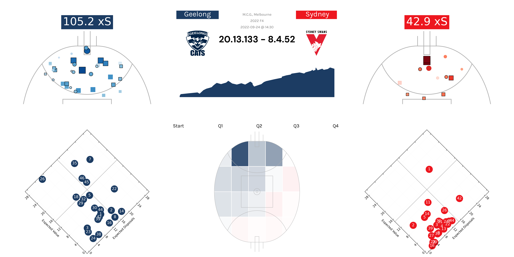
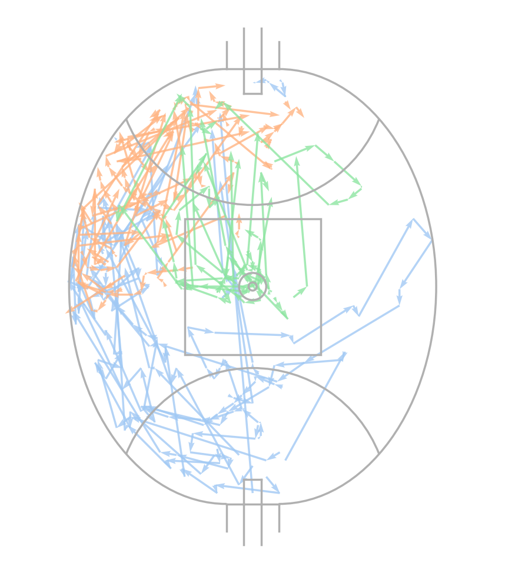
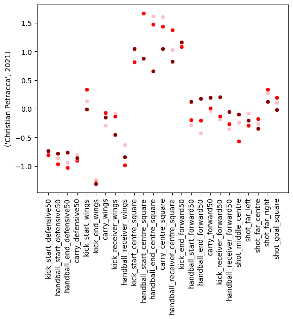
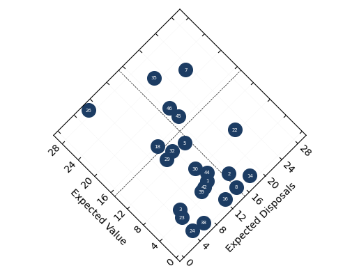
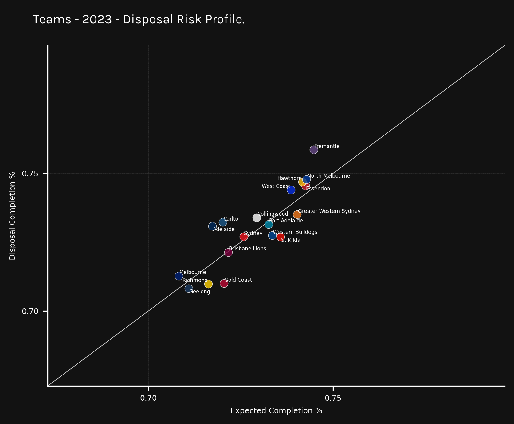
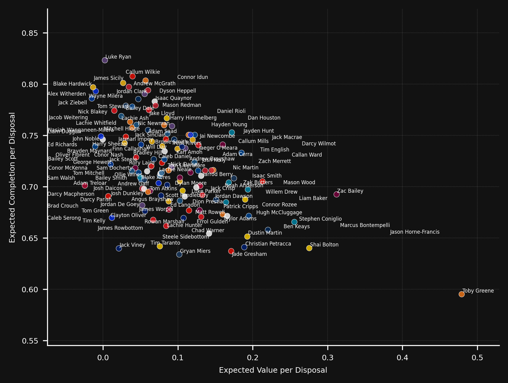
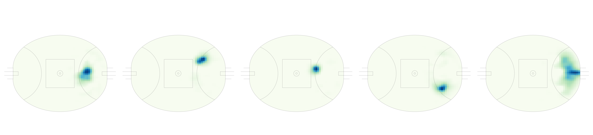
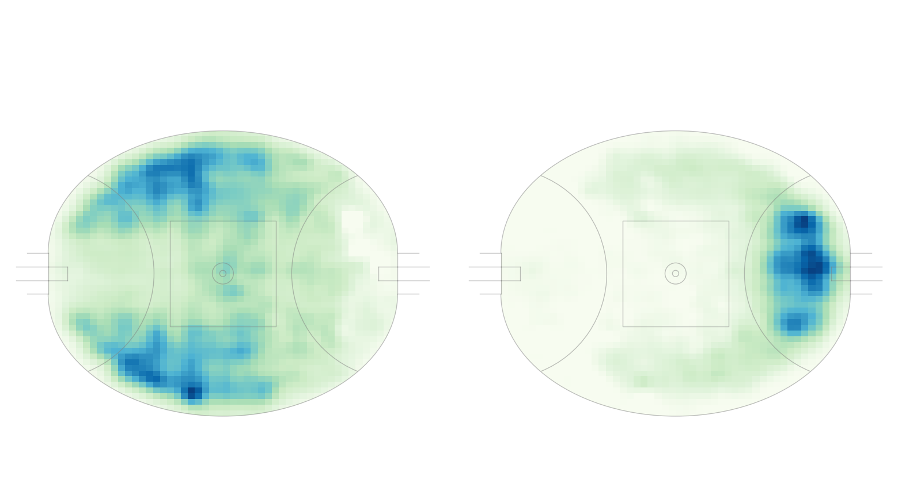
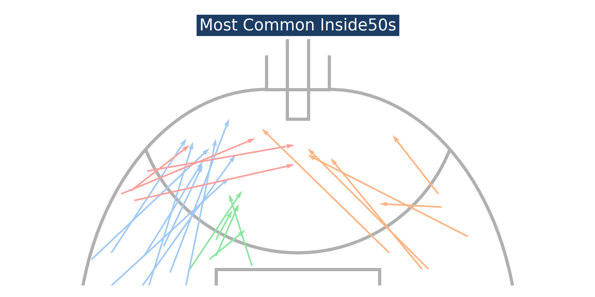

# afl-playing-styles
Exploration to understand both player and team playing styles in AFL.

## Match Reports

## Chain Data to Playing Styles

### What are we trying to achieve?
- Define and choose what we want a “style” to mean
- Identify a style of play for a team based on it’s chain data
- Identify a style of play for a player based on their chain data

### What could be important for team styles?
#### Quantify how a team goes about trying to score goals/points (In Possession Style)
- Where does the team get shots from?
    - Shot coordinates
- Where do the chains start for the chains that end in shots?
    - Chain starting coordinates
- How do the chains start for the chains that end in shots?
    - Stoppage/Turnover/%
- What do the chains that end in shots look like?
    - Turnover/stoppage
    - Number of actions in chain
    - Speed, distance, velocity, time of ball movement towards goal
    - Kicks/disposals
    - Risk % (expected disposal model)
    - Value of actions in chain (expected vaep)
    - Trajectory of chain

- What do the chains for each team look like?
    - Cluster all the chains into 50 clusters

#### Quantify how a team goes about stopping the opponent from scoring points/goals (Out of Possession Style)
- Where does the team concede shots from?
- Where do the chains start for the chains that end in shots?
- How do the chains start for the chains that end in shots?
- What do the chains that end in shots look like?
    - Turnover/stoppage
    - Number of actions in chain
    - Speed, distance, velocity, time of ball movement towards goal
    - Kicks/disposals
    - Risk % (expected disposal model)
    - Value of actions in chain (expected vaep)
    - Trajectory of chain

### What could be important for player styles?

#### Where on the pitch does the player’s actions occur?
- Cluster based on these to determine player ‘positions’
#### What are the proportions of each action that the player takes?
- Create similarity metrics with action location and proportions for player styles
#### What are the actions that the player takes relative to the team?
- Use player action locations and action types relative to team to determine player roles
#### What is the risk appetite/profile of their disposal actions?
Risk % v Expected VAEP

### What tools are useful to do this?
- NMF (Non-Negative Matrix Factorisation)

- PCA (Principal Component Analysis)
- K Means Clustering
- Gaussian Mixture Models

